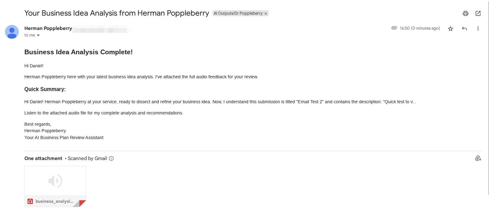

# Business Idea Refinement Agent


An AI-powered business idea analysis tool that provides comprehensive feedback through Herman Poppleberry, your friendly AI business plan review assistant.

## Features

- **Intelligent Analysis**: Uses Gemini Pro 2.5 to analyze business ideas with venture capitalist-level insights
- **Audio Feedback**: Generates personalized audio feedback using Gemini TTS with Herman Poppleberry's voice
- **Email Delivery**: Automatically sends analysis and audio feedback via email using Resend API
- **Multiple Voice Styles**: Choose from upbeat, serious, or flippant delivery styles


## Screenshots

### Agent delivers analysis by email



## Quick Start

### 1. Setup Environment

```bash
# Install dependencies
pip install -r requirements.txt

# Copy and configure environment variables
cp .env.example .env
# Edit .env with your API keys
```

### 2. Configure API Keys

Add your API keys to `.env`:
```
GEMINI_API_KEY="your_gemini_api_key_here"
RESEND_API_KEY="your_resend_api_key_here"  # Optional for email delivery
USER_EMAIL="your_email@example.com"
```

### 3. Run the Agent

```bash
# Auto-process all pending ideas
python business_idea_agent.py

# Choose voice style and skip email
python business_idea_agent.py --voice-style serious --no-email
```

## Usage Examples

### Basic Auto-Processing
```bash
# Processes all .md files in agent/user-ideas/pending/
python business_idea_agent.py
```

### Custom Voice Style
```bash
python business_idea_agent.py --voice-style serious
```

### Skip Email Notifications
```bash
python business_idea_agent.py --no-email
```

## Voice Styles

- **upbeat** (default): Encouraging and enthusiastic tone
- **serious**: Authoritative, judge-like delivery
- **flippant**: Sardonic, defeatist tone

## Output

The agent generates:
- **Text Analysis**: Saved to `agent-feedback/analysis_TIMESTAMP.txt`
- **Audio Feedback**: Saved to `agent-feedback/business_analysis_TIMESTAMP.wav`
- **Email**: Sent with both text summary and audio attachment (if configured)

## Workflow

1. **Agent Review**: Gemini Pro 2.5 analyzes your business idea using the carefully crafted system prompt
2. **TTS Generation**: Gemini 2.5 Flash Preview TTS creates audio feedback with Herman Poppleberry's voice
3. **Email Delivery**: Resend API sends results with audio attachment and summary

## Models Used

- **Text Analysis**: Gemini 2.0 Flash Exp
- **TTS**: Gemini 2.5 Flash Preview TTS (Voice: Charon)

## File Structure

```
├── business_idea_agent.py      # Main agent implementation
├── design/
│   ├── system-prompt.md        # Herman Poppleberry's instructions
│   └── gemini-audio-instruction.md  # TTS voice guidelines
├── agent/
│   ├── feedback/              # Generated outputs
│   └── user-ideas/
│       ├── drafting/          # Ideas being developed
│       ├── pending/           # Ideas awaiting analysis
│       └── evaluated/         # Processed ideas
└── requirements.txt           # Python dependencies
```

## Workflow

1. **Draft**: Create business ideas in `agent/user-ideas/drafting/`
2. **Queue**: Move ready ideas to `agent/user-ideas/pending/`
3. **Process**: Run `python business_idea_agent.py` to auto-process all pending ideas
4. **Review**: Check results in `agent/feedback/` and moved files in `agent/user-ideas/evaluated/` 